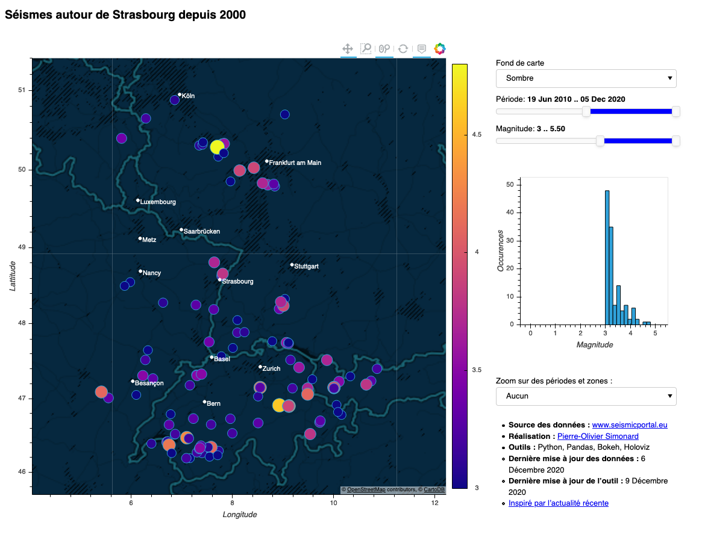

# Earthquakes 
A dashboard to visualize earthquakes worldwide since 2000. 

<a href="http://152.228.173.254/earthquakes" target="_blank">See the dashboard live.</a>

## Context

A abnormal seismic activity has been recorded in late 2020 near my city,  <a href="https://goo.gl/maps/7NRzCfcGYbbnUZzT9" target="_blank">Strasbourg, France</a>.

These unusual earthquakes may have been caused by boreholes made during the exploration phase of a geothermal energy project. 

This gave me the idea of making a dashboard to display the earthquakes worldwide and learn more about this phenomenon.

##  Data source

To make a good dashboard, you need good data.  
I used the webservices of <a href="https://www.seismicportal.eu/" target="_blank">www.seismicportal.eu</a>.

The dataset is updated automatically every hour, leveraging Github's Flat Data, with scripts under `scripts/flatdata`.
**File `data/viz/dataset.csv` is then always up to date` .**

If you wish to rebuild the whole dataset from scratch, there are 2 steps :
- collect the raw data from the webservice : `python scripts/scrapping/download_json.py`
- aggregate the json files into a csv file : `python scripts/scrapping/build_dataset.py`

## Data Engineering

The data engineering is done using pandas.

## Dashboard

The dashboard is made with Holoviz (using Holoviews, Geoviews and Panel) with the Bokeh backend.

## Questions ? 

- If you have any question on how to use this dashboard
- If you have suggestions on how to improve it

Then please contact me <a href="https://www.linkedin.com/in/pierreoliviersimonard/" target="_blank">on LinkedIn</a> or <a href="https://twitter.com/pierrotsmnrd" target="_blank">on Twitter</a>.

Pull requests are appreciated !

Also have a look to open issues for the next tasks I intend on tackle.

## Thanks

Thanks to @kcpevey and @tonyfast for their help and encouragements.
